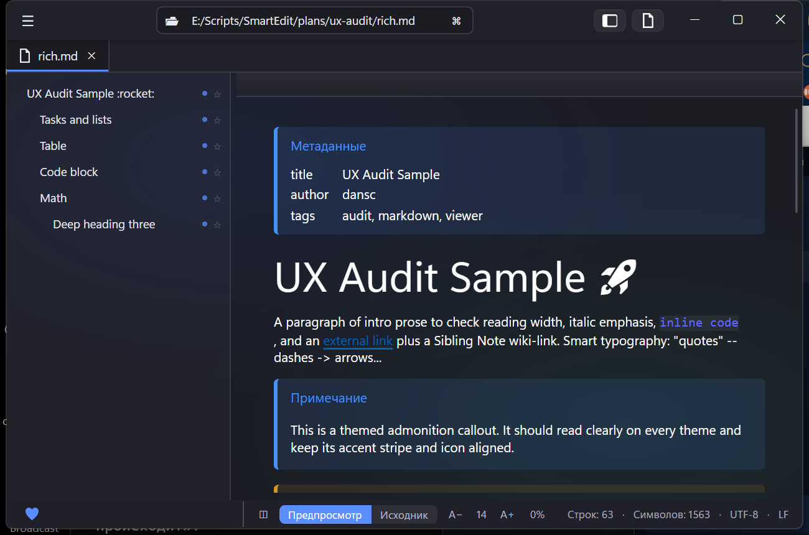
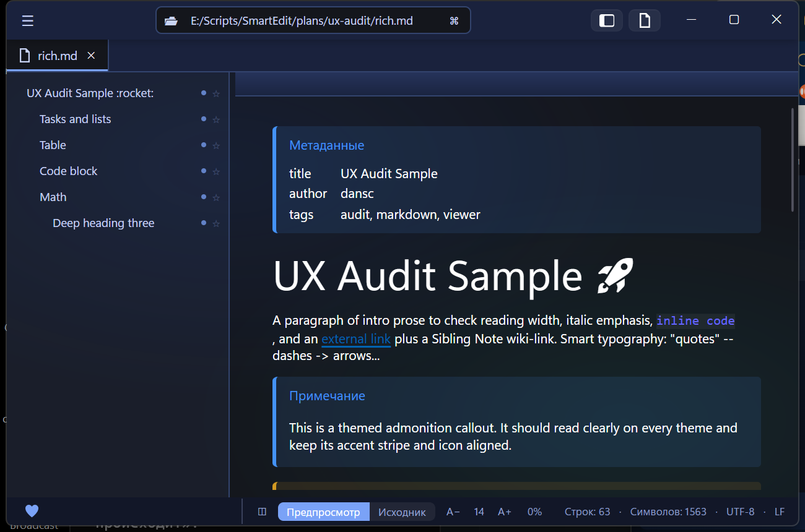
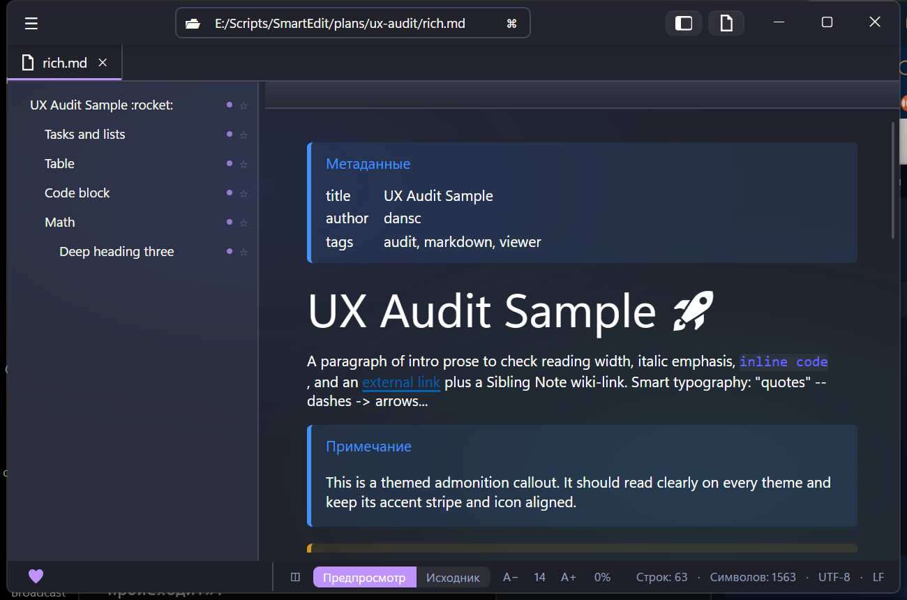
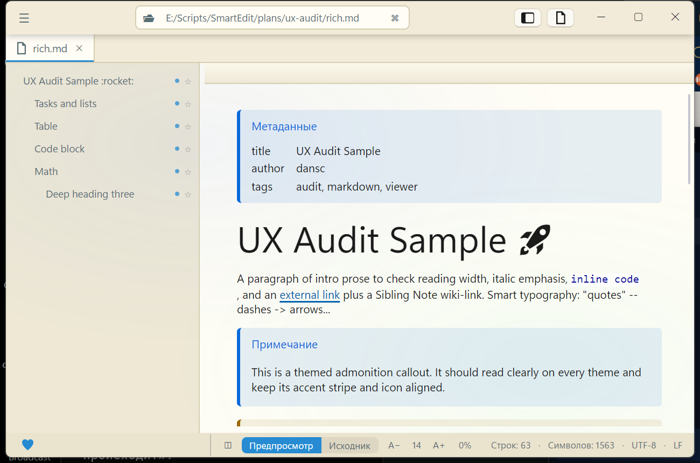

<div align="center">


# Tittle

**A native, cross-platform desktop markdown &amp; code viewer — [Avalonia](https://avaloniaui.net/) + Skia, no WebView.**

[](https://github.com/danscMax/Tittle/actions/workflows/ci.yml)
[](https://github.com/danscMax/Tittle/releases/latest)
[](LICENSE)


**English** · [Русский](README.ru.md)

</div>

---

> **Status: feature-complete v0.x.** Milestones M1–M15 shipped — rendering, TOC, search,
> live-reload, math, export, 14 themes, in-place editing. The full feature port from the
> original HTML/WebView viewer is closed (diagrams excepted — see [`BACKLOG.md`](BACKLOG.md)).

A deliberate rewrite of an HTML/WebView markdown viewer as a **native** app: it renders through
Skia, not a browser engine — so it starts instantly, stays light, and reads the same on Windows,
Linux and macOS.

<div align="center">

| | |
|:-:|:-:|
|  |  |
|  |  |

<sub><b>Dark</b> · <b>Deep Blue</b> · <b>Dracula</b> · <b>Solarized Light</b> — 4 of 14 built-in themes</sub>

</div>

## Contents

- [Features](#features)
- [Tech stack](#tech-stack)
- [Project layout](#project-layout)
- [Build &amp; run](#build--run)
- [Contributing](#contributing)
- [License](#license)

## Features

**Markdown** — GFM preview (tables · task lists · footnotes · admonitions/alerts · emoji),
block math (native CSharpMath, `$$…$$` / `\[…\]`), YAML front-matter panel, wiki-links
(`[[name]]` opens the sibling note), collapsible sections, click-to-sort tables, copy
buttons on code blocks, image lightbox, checkbox click-to-toggle (writes back to the file).

**Navigation** — TOC sidebar with active-heading scroll-spy, unread marks and ☆ bookmarks;
heading breadcrumbs (markdown *and* code symbols); position-preserving preview↔source
toggle; in-document find (Ctrl+F, regex/case); go-to-line; **Ctrl+K** command palette;
back-to-top; reading-width presets.

**Code &amp; text files** — TextMate syntax highlighting, cv-* token decorations (timestamps,
UUIDs, IPs, hashes, TODOs, log levels, units, dates — with resolved-value hover tooltips),
indent guides, code minimap, symbol/text outlines, section folding, CSV/TSV as a sortable
table, JSON/XML/NDJSON pretty-print, TOML/INI/.env as a key/value table, smart typography for
plain text, document statistics (RU-adapted Flesch).

**PDF** — an in-app page-by-page viewer (PDFium via Skia, no WebView): fit-width rendering,
lazy/virtualized pages, Ctrl+± zoom; falls back to the OS viewer if the native engine is
unavailable.

**Images** — raster (PNG/JPEG/WebP/BMP/GIF/ICO) and SVG files viewed in-app: fit-to-window,
Ctrl+± zoom; raster decoded natively via Skia, SVG rendered vectorially.

**Diagrams** — ` ```mermaid `/` ```plantuml `/` ```dot ` (and every other Kroki type) rendered in
the preview via a **Kroki** server (Mermaid → PNG, the rest → SVG). Opt-in and off by default — the
diagram text is sent to the configured server (public or self-hosted); enable it in Настройки ▸ Раскладка.

**Shell** — tabs (drag-reorder, context menu, kept-alive content), single-instance file
forwarding, live-reload with a "changed on disk" dot and position-preserving refresh,
session restore, split view with live mutual scroll, **14 themes** (Dark/Light + Midnight,
Ocean, Deep Blue, Nord, Dracula, Solarized ×3, Gruvbox ×2, Sepia, High-Contrast), settings
import/export, F1 help.

**Editing** — edit in the source view, **Ctrl+S** saves (UTF-8); an unsaved-changes ● marker
on the tab.

**Export** — self-contained themed HTML (Markdig), copy-as-rich-text (CF_HTML),
print / save-as-PDF via the browser.

## Tech stack

| Area | Choice |
|------|--------|
| UI | Avalonia 11.3 (FluentAvaloniaUI v2, Mica/Acrylic) |
| Markdown | Markdown.Avalonia (preview) · Markdig (export) |
| Editor | AvaloniaEdit + TextMate (TextMateSharp grammars) |
| Math | Sylinko.CSharpMath.Avalonia (native, no JS) |
| PDF | PDFtoImage 4.x (PDFium, native, no WebView) |
| Images | Avalonia/Skia (raster) · Avalonia.Svg.Skia (SVG) |
| MVVM | CommunityToolkit.Mvvm |
| DI | Microsoft.Extensions.DependencyInjection |
| Tests | xUnit + Avalonia.Headless (840+) |
| Packages | Central Package Management (`Directory.Packages.props`) |

> **Why Avalonia 11, not 12?** The viewer ecosystem we depend on is not yet stable on 12
> (Markdown.Avalonia 12 is alpha, FluentAvaloniaUI 3 is preview). Migration is planned once
> both ship stable 12 builds.

## Project layout

```
src/Tittle         UI (Avalonia, feature slices, services, themes)
src/Tittle.Core    pure .NET 9 library (abstractions + logic, no Avalonia)
tests/Tittle.Tests xUnit + Avalonia.Headless
```

Core has **no** Avalonia dependency: UI concerns (dialogs, theming, clipboard) live behind
interfaces in `Core` with implementations in `Tittle`. See [`ARCHITECTURE.md`](ARCHITECTURE.md).

## Build &amp; run

Requires the **.NET 9 SDK**.

```bash
dotnet build Tittle.sln -c Release
dotnet run --project src/Tittle            # or: Tittle <path-to-file>
dotnet test Tittle.sln                     # unit + Headless UI tests
```

Windows portable build: `build.ps1` / `build.bat` → `dist/Tittle.exe`;
combined build: `build_all.ps1` / `build_all.bat` → test gate + `dist/win-x64/` +
`dist/win-arm64/` + `build-manifest.json`; per-user file association via
`install-fileassoc.ps1`.

## Contributing

Issues and PRs welcome. The codebase keeps a strict boundary: `Tittle.Core`
must not reference Avalonia; UI concerns live behind interfaces in `Core` with
implementations in `Tittle`. See [`ARCHITECTURE.md`](ARCHITECTURE.md) and
[`BACKLOG.md`](BACKLOG.md).

## License

[Apache-2.0](LICENSE).
