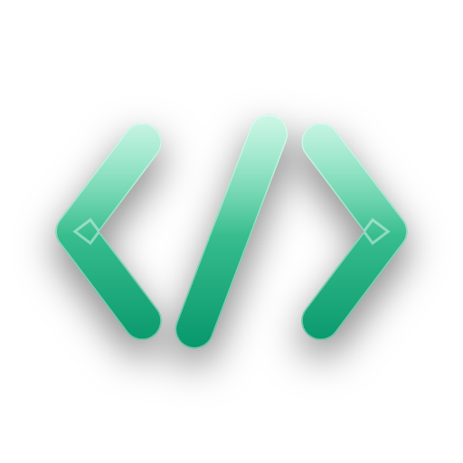

<div align="center">



# SeriousView

**Нативный кроссплатформенный десктопный просмотрщик markdown и кода — [Avalonia](https://avaloniaui.net/) + Skia, без WebView.**

[](https://github.com/danscMax/SeriousView/actions/workflows/ci.yml)
[](https://github.com/danscMax/SeriousView/releases/latest)
[](LICENSE)


[English](README.md) · **Русский**

</div>

---

> **Статус: функционально завершён, v0.x.** Закрыты вехи M1–M15 — рендеринг, оглавление, поиск,
> живая перезагрузка, формулы, экспорт, 14 тем, редактирование на месте. Полный перенос функций
> из оригинального HTML/WebView-просмотрщика завершён (кроме диаграмм — см. [`BACKLOG.md`](BACKLOG.md)).

Осознанное переписывание HTML/WebView-просмотрщика markdown в **нативное** приложение: рендеринг
идёт через Skia, а не через браузерный движок — поэтому запуск мгновенный, расход памяти низкий,
а вид одинаков на Windows, Linux и macOS.

<div align="center">

| | |
|:-:|:-:|
|  |  |
|  |  |

<sub><b>Dark</b> · <b>Deep Blue</b> · <b>Dracula</b> · <b>Solarized Light</b> — 4 из 14 встроенных тем</sub>

</div>

## Содержание

- [Возможности](#возможности)
- [Технологии](#технологии)
- [Структура проекта](#структура-проекта)
- [Сборка и запуск](#сборка-и-запуск)
- [Участие в разработке](#участие-в-разработке)
- [Лицензия](#лицензия)

## Возможности

**Markdown** — предпросмотр GFM (таблицы · списки задач · сноски · admonition/alert-блоки ·
эмодзи), блочные формулы (нативный CSharpMath, `$$…$$` / `\[…\]`), панель YAML front-matter,
wiki-ссылки (`[[имя]]` открывает соседнюю заметку), сворачиваемые секции, сортировка таблиц
по клику, кнопки копирования у блоков кода, лайтбокс для изображений, переключение чекбоксов
кликом (с записью обратно в файл).

**Навигация** — боковая панель оглавления со scroll-spy активного заголовка, метками
«непрочитано» и закладками ☆; хлебные крошки по заголовкам (markdown *и* символы кода);
переключение предпросмотр↔исходник с сохранением позиции; поиск по документу (Ctrl+F,
regex/регистр); переход к строке; командная палитра **Ctrl+K**; кнопка «наверх»; пресеты
ширины чтения.

**Код и текстовые файлы** — подсветка синтаксиса TextMate, cv-* декорации токенов (метки
времени, UUID, IP, хеши, TODO, уровни логов, единицы, даты — с подсказками-расшифровками при
наведении), направляющие отступов, миникарта кода, оглавление по символам/тексту, сворачивание
секций, CSV/TSV как сортируемая таблица, форматирование JSON, умная типографика для простого
текста, статистика документа (адаптированный под русский индекс Флеша).

**Оболочка** — вкладки (перетаскивание, контекстное меню, контент остаётся «живым»), пересылка
файлов в единственный экземпляр, живая перезагрузка с точкой «изменён на диске» и обновлением с
сохранением позиции, восстановление сессии, режим разделённого окна со взаимной синхронизацией
прокрутки, **14 тем** (Dark/Light + Midnight, Ocean, Deep Blue, Nord, Dracula, Solarized ×3,
Gruvbox ×2, Sepia, High-Contrast), импорт/экспорт настроек, справка по F1.

**Редактирование** — правка в исходном виде, **Ctrl+S** сохраняет (UTF-8); маркер несохранённых
изменений ● на вкладке.

**Экспорт** — самодостаточный тематический HTML (Markdig), копирование как rich-text (CF_HTML),
печать / сохранение в PDF через браузер.

## Технологии

| Область | Выбор |
|---------|-------|
| UI | Avalonia 11.3 (FluentAvaloniaUI v2, Mica/Acrylic) |
| Markdown | Markdown.Avalonia (предпросмотр) · Markdig (экспорт) |
| Редактор | AvaloniaEdit + TextMate (грамматики TextMateSharp) |
| Формулы | Sylinko.CSharpMath.Avalonia (нативно, без JS) |
| MVVM | CommunityToolkit.Mvvm |
| DI | Microsoft.Extensions.DependencyInjection |
| Тесты | xUnit + Avalonia.Headless (840+) |
| Пакеты | Central Package Management (`Directory.Packages.props`) |

> **Почему Avalonia 11, а не 12?** Экосистема просмотрщика, от которой мы зависим, ещё не
> стабильна на 12 (Markdown.Avalonia 12 — alpha, FluentAvaloniaUI 3 — preview). Миграция
> запланирована, как только обе выпустят стабильные сборки под 12.

## Структура проекта

```
src/SeriousView         UI (Avalonia, feature-slices, сервисы, темы)
src/SeriousView.Core    чистая библиотека .NET 9 (абстракции + логика, без Avalonia)
tests/SeriousView.Tests xUnit + Avalonia.Headless
```

Core **не** зависит от Avalonia: UI-аспекты (диалоги, темы, буфер обмена) спрятаны за
интерфейсами в `Core`, а реализации живут в `SeriousView`. См. [`ARCHITECTURE.md`](ARCHITECTURE.md).

## Сборка и запуск

Требуется **.NET 9 SDK**.

```bash
dotnet build SeriousView.sln -c Release
dotnet run --project src/SeriousView            # или: SeriousView <путь-к-файлу>
dotnet test SeriousView.sln                     # модульные + Headless UI тесты
```

Портативная сборка под Windows: `build.ps1` / `build.bat` → `dist/SeriousView.exe`;
комбинированная сборка: `build_all.ps1` / `build_all.bat` → прогон тестов + `dist/win-x64/` +
`dist/win-arm64/` + `build-manifest.json`; ассоциация файлов для пользователя через
`install-fileassoc.ps1`.

## Участие в разработке

Issues и PR приветствуются. В кодовой базе строгая граница: `SeriousView.Core` не должен
ссылаться на Avalonia; UI-аспекты — за интерфейсами в `Core` с реализациями в `SeriousView`.
См. [`ARCHITECTURE.md`](ARCHITECTURE.md) и [`BACKLOG.md`](BACKLOG.md).

## Лицензия

[Apache-2.0](LICENSE).
